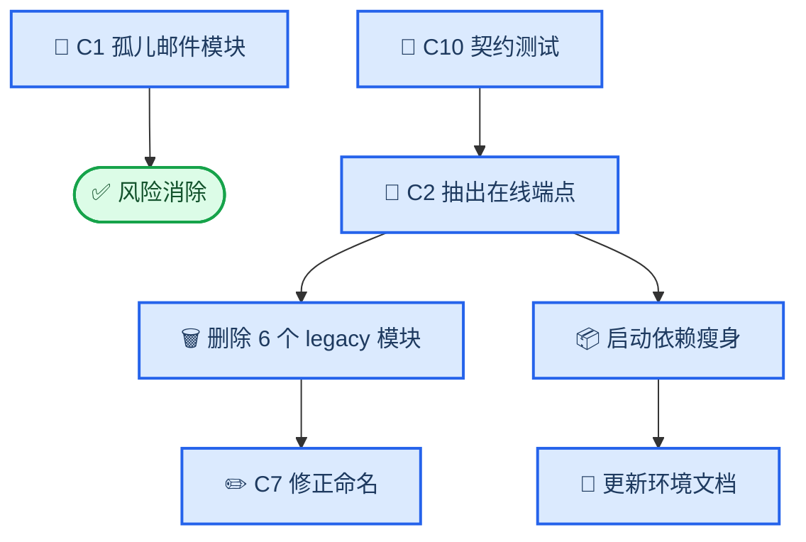

# MALER 代码侧待办

_依据本地可运行基线盘点 · Python 3.7.12 / Django 2.1.8 / 36 项测试通过 · 2026-09-22_

---

## 📋 TL;DR

- 本地 `runserver` 已可用，功能基线成立；本文件只列**代码侧**尚未处理的工作，不含部署与稿件文字。
- **两项高优先级**：`mlserver/views/send_email.py` 是无人引用的孤儿模块，却在**模块级**直接调用 `send_mail`，并硬编码了两个私人邮箱地址；`/maler/get_cp_combination` 这条**在线**路由仍挂在 legacy 模块上，是死代码无法清理的唯一障碍。
- 清理 legacy 后，应用启动不再强制加载 `xgboost`、`lightgbm`、`scikit-survival`、`lifelines`、`matplotlib`、`seaborn`，环境可显著瘦身。
- 现有 36 项测试不覆盖 legacy AJAX 端点，也不断言 `*_ws/` 路由的禁用行为。
- 另有若干中低优先级项：被 git 跟踪的备份模板与 `.pyc`、验证脚本会覆盖写证据文件、出图脚本输出到仓库之外、容量脚本仅限 Windows。

---

## 🎯 范围与前提

| 在范围内 | 不在范围内 |
| --- | --- |
| Django 应用代码、模板、URL 映射 | 阿里云部署与线上验收 |
| `validation/` 下的本地脚本质量 | 稿件正文、表格、补充材料、回复信文字 |
| 仓库卫生与可复现性文件 | 是否公开代码仓库的决策 |

前提：环境 `maler` 已配好，`runserver` 可启动，本地脚本可运行不依赖外部数据的部分。

---

## ✅ 当前基线

| 检查 | 结果 |
| --- | --- |
| `manage.py check` | 无问题 |
| `manage.py test mlserver` | 36/36 通过 |
| 公开路由 | `/maler/home`、`/maler/analysis`、`/maler/analysis/methods.json`、`/maler/predict`、`/maler/help` 均 200 |
| 安全审计（生产口径） | 10/10 |

---

## 🧩 任务总览

| # | 任务 | 优先级 | 阻塞关系 |
| --- | --- | --- | --- |
| C1 | 处置孤儿邮件模块的导入期副作用与硬编码邮箱 | 🔴 高 | 独立 |
| C2 | 抽出 `get_cp_combination`，解除 legacy 依赖并删除死代码 | 🔴 高 | 解锁 C7，并影响启动依赖 |
| C3 | 保护验证脚本对既有证据文件的覆盖写 | 🟡 中 | 独立 |
| C4 | 修正出图脚本的输出路径 | 🟡 中 | 独立 |
| C5 | 容量脚本跨平台化 | 🟡 中 | 独立 |
| C6 | 清理被跟踪的备份模板与字节码 | 🟡 中 | 独立 |
| C7 | 修正模块名拼写错误 | 🟢 低 | 依赖 C2 |
| C8 | 清理死注释与注释块内的旧路径 | 🟢 低 | 独立 |
| C9 | 补齐仓库入口文件（README / LICENSE / requirements） | 🟢 低 | 与可复现包相关 |
| C10 | 补充测试覆盖（legacy 端点、禁用路由断言） | 🟢 低 | C2 前后各一次 |
| C11 | 外部数据获取脚本（可选） | 🟢 低 | 与可复现性声明相关 |

---

## 🔴 高优先级

### C1 孤儿邮件模块的导入期副作用

**证据**

`mlserver/views/send_email.py`（194 行）在全部 `.py` 与模板中**引用数为 0**，但文件第 26–33 行是**模块级可执行代码**：

| 行 | 内容 |
| --- | --- |
| 26 | `from_mail = 'linzhewei1999@163.com'`（硬编码私人地址） |
| 27 | `to_mail = '1198369937@qq.com'`（硬编码私人地址） |
| 28 | `print('发送邮件' + content)` |
| 29–31 | **`send_mail(...)` 直接执行** |

同时第 5 行用 `from ML_WebServer import settings` 而非 `django.conf.settings`，属反模式。

**影响**

目前它无人引用，处于休眠状态；但只要有任何一次 `import mlserver.views.send_email`（例如 IDE 自动补全、后续重构误引、`startapp` 式遍历），就会在导入瞬间尝试通过 SMTP 向硬编码地址发信，并把私人邮箱暴露在仓库历史中。邮件功能实际由 `mlserver/views/validated_analysis_views.py:9,60` 直接使用 `send_mail` 承担，另有 `classification_oc_result_view_webscoket.py:1472-1486` 自带一份副本。

**动作**

删除该文件；若判定仍需保留，则至少移除模块级调用与硬编码地址，改为仅暴露函数并改用 `django.conf.settings`。

**验收**

`grep -rn "send_email" --include="*.py" .` 无结果；仓库内不再出现硬编码邮箱；36 项测试仍通过。

### C2 抽出 `get_cp_combination`，解除 legacy 依赖

**证据**

| 项 | 位置 | 说明 |
| --- | --- | --- |
| 在线路由 | `mlserver/urls.py:69` | `path('get_cp_combination', classification_cp_result_view_websocket.get_cp_combination)` |
| 实现 | `mlserver/views/classification_cp_result_view_websocket.py:2048` | 位于一个 3004 行的 legacy 模块内 |
| 调用方 | `mlserver/templates/classification_cp_result_ws.html:338` | 页面 AJAX 调用该地址 |
| 启动导入 | `mlserver/urls.py:5-8` | 顶层导入 **6 个** legacy 模块，含拼写错误的 `classification_oc_result_view_webscoket` |

这 6 个模块在模块级导入 `xgboost`、`lightgbm`、`scikit-survival`、`lifelines`、`matplotlib`、`seaborn`、`dwebsocket`，因此**打开首页也要求这 7 个包在位**。其余 `*_ws/` 路由已统一改为 `validated_analysis_views.legacy_disabled`，只有 `get_cp_combination` 仍指向旧模块。

旧路径还并存着一套与新引擎不同的特征选择实现（`mlserver/views/featureselection_method.py`，其中 `mrmr_fs` 硬编码 `n_jobs=4`），而论文只描述新引擎的 `safe_ml.MRMRSelector`。

**影响**

- 死代码无法删除，仓库持续携带约 1.2 万行不再提供服务的旧逻辑。
- 启动被强制绑定重依赖，环境无法真正瘦身。
- 「旧端点已禁用」的表述与「旧模块仍被导入且其中一条路由在线」存在事实落差。
- 两套特征选择实现并存，是「稿件描述与实际代码不一致」的潜在来源。

**动作**

1. 将 `get_cp_combination` 抽到独立的中性模块（或并入 `validated_analysis_views`），保持返回结构不变。
2. 为该端点补一个契约测试（当前 36 项测试完全没覆盖它）。
3. 路由改指新位置后，删除 6 个 legacy 模块、`featureselection_method.py` 与其 legacy 模板。
4. 同步更新 `docs/environment-setup.md` 的依赖说明与 `docs/revision-status.md` 的不一致清单。

**验收**

`mlserver/urls.py` 不再导入任何 legacy 模块；`/maler/get_cp_combination` 仍返回 200 且响应结构不变；36 项测试（含新增契约测试）通过；应用启动仅需核心依赖。

---

## 🟡 中优先级

### C3 保护验证脚本对既有证据文件的覆盖写

**证据**：多个脚本无条件写回受版本控制的证据文件，例如 `validation/audit_survival_data_quality.py:126-127`、`validation/audit_legacy_survival_model.py:104-105`，目标均为 `validation/results/*.json`。

**影响**：既有证据产生于 Windows + MKL 环境；在本机重跑可能产生细微数值差异，直接覆盖会让「论文数字」与「仓库结果文件」脱钩，且改动会进入提交历史。

**动作**：为脚本增加 `--out-dir` 或 `--dry-run`，默认写入临时目录，显式确认后才覆盖正式结果；或在文件头写明必须先在分支/副本中运行。

**验收**：默认运行不修改任何受跟踪文件；`git status` 保持干净。

### C4 修正出图脚本的输出路径

**证据**：`validation/make_validation_figures.py:29` 把输出目录设为 `os.path.dirname(REPOSITORY_ROOT)` 下的 `article-review/revision/figures`，即**仓库之外**。

**影响**：产物游离在版本控制之外，打包与复核都容易漏；目前只生成 S1–S6，缺 S7。

**动作**：改为可通过参数或环境变量指定输出目录，默认落在受控路径内。

**验收**：在不传参时也能产出可预期的路径，且该路径已在 `.gitignore` 或提交策略中明确。

### C5 容量脚本跨平台化

**证据**：`validation/benchmark_capacity.py:11,19,47` 使用 `ctypes.wintypes` 与 `PROCESS_MEMORY_COUNTERS_EX` 读取 `PeakWorkingSetSize`，属 Windows 专用 API。

**影响**：Linux 上无法运行，容量数据只能引用既有结果，无法在本地复现。

**动作**：抽象内存测量层（Windows 用原实现，Linux 用 `resource.getrusage` 的 `ru_maxrss`），并在输出中标注平台。

**验收**：同一入口可在两个平台运行，且结果文件记录平台字段。

### C6 清理被跟踪的备份模板与字节码

**证据**

| 文件 | 问题 |
| --- | --- |
| `mlserver/templates/analysis.html.bak` | 已被 `analysis.html` / `validated_result.html` 取代 |
| `mlserver/templates/analysis.html (2).bak` | 文件名含空格与括号，违反路径命名规范 |
| `mlserver/templates/analysis.html.1114bak` | 同上，命名无意义 |
| `mlserver/templates/home.html.bak` | 已被 `home.html` 取代 |
| `mlserver/migrations/__pycache__/__init__.cpython-37.pyc` | 被 git 跟踪，每次运行测试或服务都被改写，制造假改动 |

**动作**：从索引移除并补充忽略规则；删除前用 `git log` 确认无独有内容。

**验收**：`git ls-files | grep -E "__pycache__|\.pyc$|\.bak$"` 为空；跑完测试后 `git status` 仍干净。

---

## 🟢 低优先级

| # | 任务 | 证据 | 动作 | 验收 |
| --- | --- | --- | --- | --- |
| C7 | 修正模块名拼写错误 | `classification_oc_result_view_webscoket.py`（`webscoket`）在 `urls.py` 中被导入 | 随 C2 删除，或更名为合规名称 | 仓库内无拼写错误文件名 |
| C8 | 清理死注释与旧路径 | `settings.py:181-186` 的 uWSGI/WebSocket 注释；`predict_views.py:168-190` 注释块内含 Windows 绝对路径与旧示例数据路径 | 删除或改为说明性注释 | 代码内不再出现 Windows 绝对路径 |
| C9 | 补齐仓库入口文件 | 根 `README.md` 为 0 字节；无 `LICENSE`；无 `requirements` | 补最小 README（安装、测试、启动、访问地址）、许可证与依赖清单 | 新成员按 README 可跑通 36 项测试 |
| C10 | 补充测试覆盖 | 测试未覆盖 `get_cp_combination`，也未断言 `*_ws/` 路由返回禁用 | C2 前补契约测试，C2 后补禁用路由断言 | 新增测试纳入 36 项并全部通过 |
| C11 | 外部数据获取脚本（可选） | `run_external_gse37745.py`、`run_external_gse50081.py`、`audit_external_data_quality.py`、`run_survival_expanded_validation.py` 依赖未入库的原始矩阵 | 提供带校验（SHA-256）的下载脚本，或在文档中明确来源与筛选规则 | 他人可据此取得同版本数据 |

---

## 🗺️ 依赖关系与建议顺序

**建议顺序**

1. C1：改动最小、风险最直接，先做。
2. C3 + C6：属于「防自己踩坑」的清理，做完再动业务代码更安全。
3. C10 的契约测试 → C2 的端点抽取与死代码删除。
4. C4、C5、C7、C8：随相关模块改动顺手完成。
5. C9、C11：与可复现打包一起收尾。

---

## 🚨 风险与注意事项

| 风险 | 说明 | 应对 |
| --- | --- | --- |
| C2 删除 legacy 模块可能影响仍被引用的模板 | `classification_cp_result_ws.html` 等 legacy 模板已不再路由，但需先确认没有其它引用 | 删除前用引用搜索逐一确认，并保留一次可回退提交 |
| C2 改变启动依赖集合 | 环境文档与「最少安装」清单需同步更新 | 改动后重跑 `manage.py check`、36 项测试与安全审计，再更新 `docs/environment-setup.md` |
| 重跑验证脚本污染证据 | 直接覆盖 `validation/results/*.json` | 先在分支或副本中运行，或先完成 C3 |
| 删除备份模板误删独有内容 | `.bak` 可能含未合并的旧界面细节 | 删除前先对比差异，必要时先归档到仓库外 |
| 改动与稿件叙述的耦合 | 删除旧模块会让「旧端点已禁用」更贴合事实，但回复信与补充材料中的相关措辞需同步 | 改动完成后同步 `docs/revision-status.md` 的不一致清单 |

---

## 🔗 相关文档

- [`environment-setup.md`](environment-setup.md) — 本地最小环境与验收证据
- [`revision-status.md`](revision-status.md) — 返修工作状态、执行计划与已知不一致
- [`../validation/README.md`](../validation/README.md) — 验证脚本的设计口径与运行方式
