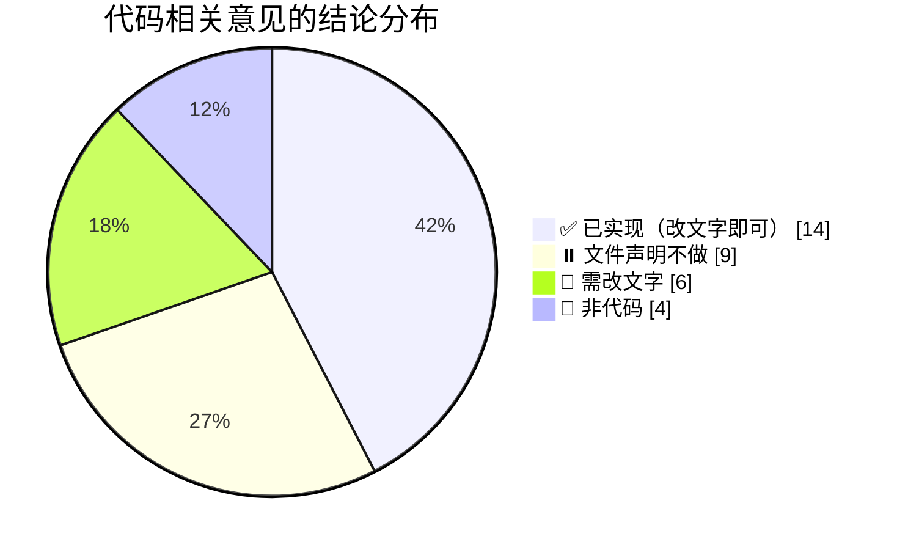
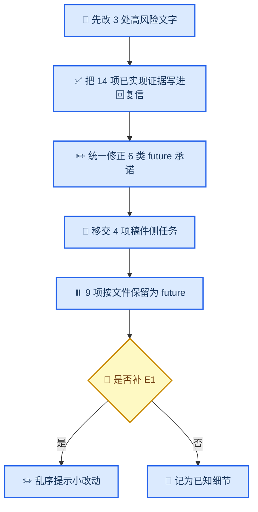

# MALER 审稿意见 → 代码侧对照表

_把 `MALER_Response_Letter_Draft.docx` 与 `MALER_Revision_Guidance_CN.docx` 中涉及代码的意见逐条映射到当前实现 · 依据本地 `maler` 环境实测 · 2026-09-22_

---

## 📋 TL;DR

- **审稿意见在代码侧基本已经满足。** 33 项代码相关意见中，14 项已由当前实现覆盖，6 项是文字与代码脱节，4 项属非代码（数据侧或纯文字），9 项被两份文件明确声明为"留给未来版本"。
- **核心问题不是缺功能，而是文字滞后。** 两份文件反复把"嵌套 CV、PCA 选项、扩展分类/生存指标、多任务验证、完整 pipeline 导出、留出集置信区间、预测特征校验"写成 future version，而代码**已经实现**。
- **真正需要改代码的条目只有 1 项**（预测矩阵特征乱序不告警），且该细节已被回复信归入"更完善的告警留待未来版本"。
- **三处必须改文字**（否则会被对照代码发现）：Cox 预筛的描述、上传上限 300 MB、以及"嵌套 CV 尚未实现"的立场。
- 工程卫生类问题（孤儿模块、legacy 死代码、被跟踪的 `.bak`/`.pyc` 等）**本轮不处理**，收在[附录](#-附录工程卫生项暂不处理)。

---

## 🎯 判定口径与图例

| 状态 | 含义 | 后续动作 |
| --- | --- | --- |
| ✅ 已实现 | 代码可核对，功能存在 | 把证据写进回复信，替换 `AUTHOR VERIFICATION REQUIRED` |
| 📄 需改文字 | 文字与代码不符，代码为准 | 修订正文/表格/回复信，不需要写代码 |
| 🔧 需改代码 | 意见要求的能力确实缺失 | 排期实现 |
| ⏸️ 文件声明不做 | 两份文件明确写"future version"或"不建议本轮重构" | **以文件为准，本轮不实现** |
| 🚫 非代码 | 数据准备、统计公式、术语、文献 | 归入稿件侧任务 |

> 📌 用户既定规则：若两份文件明确提出不对审稿意见进行实现，则以文件为准。据此，⏸️ 类条目即使代码上可行，本轮也不动。

---

## 📊 结论分布

_33 项代码相关意见按处理方式归类：_

| 结论 | 数量 | 代表条目 |
| --- | --- | --- |
| ✅ 已实现 | 14 | 折内嵌套 CV、优化指标与注册表、输入质控、模型导出内容、扩展指标 |
| ⏸️ 文件声明不做 | 9 | 高级插补、算法特定预处理、容器化、系统性规模基准 |
| 📄 需改文字 | 6 | Cox 预筛描述、上传上限、插补方式、CV 立场、future 清单、旧模块表述 |
| 🚫 非代码 | 4 | 划分细节、Data Availability、回归公式、术语与文献 |

---

## ✅ 已实现（只需把证据写进回复信）

| # | 意见来源 | 事项 | 代码/产物证据 | 可直接写入回复信的结论 |
| --- | --- | --- | --- | --- |
| A1 | 指导 §一；信 R2#4、R2#5、R3 Major 2 | 插补、缩放、特征选择、调参是否在折内完成 | `safe_ml.py:262-281`（插补/缩放/降维装在 `Pipeline` 内）、`safe_ml.py:445-479,506-537`（嵌套外层+内层）、`validated_analysis.py:238-253,347` | 是。所有数据依赖步骤均封装在 `Pipeline` 中，随每个训练折独立 `fit` |
| A2 | 指导 §一；信 R2#6、R3 Major 4 | 各任务的优化指标 | `model_registry.py:20,86,146`（`balanced_accuracy` / `r2` / `c_index`）、`safe_ml.py:560-568`、UI 说明 `analysis.html:2374` | 分类按 balanced accuracy、回归按 R²、生存按 concordance index 调参，与注册表声明一致 |
| A3 | 信 R2#6、R3 Minor 5 | 精确类名、默认值、可搜索范围 | `analysis.html:2375` 指向机器可读注册表 `analysis/methods.json`；`model_registry.py` | 全部 estimator 类名、默认值、缩放需求与搜索值由版本化注册表提供，随结果可下载 |
| A4 | 信 R3 Minor 6 | 零方差/重复/无穷/非数值/全缺失质控 | `safe_ml.py:73-118` `validate_feature_matrix`、`validate_target` | 七类检查全部实现：空矩阵、样本与特征重复标识、非数值、无穷值、全缺失、超 80% 缺失、零方差，均给出可读错误 |
| A5 | 信 R3 Minor 9 | Predict 按标识匹配并检测异常特征 | `safe_ml.py:590-609` `align_prediction_frame`；测试 `tests.py:61` | 按标识对齐并按训练特征顺序重排；缺失、重复、全缺失、无穷值均拒绝；多余特征被识别并可选择性拒绝 |
| A6 | 指导 §一；信 R3 Minor 8 | 导出模型是否含插补/缩放/特征顺序/标签编码 | `safe_ml.py:612-649`；包内 `manifest.json`（`feature_names`、`model_class`、`versions`）+ `model.joblib` + `signature.sha256` | 导出的是**完整 Pipeline**（插补→缩放→降维→估计器）而非裸估计器，manifest 记录特征顺序、类名、六个包版本与签名 |
| A7 | 指导 §二 | MRMR 的包名与函数 | `safe_ml.py:163-169`；实测 `mrmr-selection 0.2.8` 签名支持 `n_jobs`、`show_progress` | 使用 `mrmr-selection` 的 `mrmr_classif` / `mrmr_regression`，非旧版 `mrmr==0.9.2` |
| A8 | 指导 §三；信 R1#5、R2#8 | specificity、balanced accuracy、MCC、PR-AUC、多分类平均 | `internal_cv_summary.csv`（含 `specificity`、`balanced_accuracy`、`mcc`、`pr_auc`、`pr_auc_macro`、`roc_auc_ovr_macro`）；结果页 `validated_result.html:47-53` 按行渲染全部指标 | 上述指标均已计算并展示，非 future 项 |
| A9 | 信 R2#9、R3 Minor 9 | time-dependent AUC、integrated Brier score | `heldout_test_summary.csv`（`survival,time_auc_mean`）、`survival.json`（`integrated_brier_score`、`nested_cv`） | 已实现并按可比对计算；**校准曲线仍缺失**，只有该项可如实列为 future |
| A10 | 信 R2#2、R3 Major 1 | 多分类/回归/生存的验证与无特征选择基线 | `multiclass_classification.json`、`regression.json`、`survival.json`、`survival_expanded_validation.json`、`equal_budget_no_selection_baselines.json` | 四类任务与等预算无选择基线均已产出结果，不再只是"声明支持" |
| A11 | 信 R3 Minor 3 | 留出集指标的不确定性 | `heldout_test_summary.csv` 含 `bootstrap_ci_low/high`；`validation/README.md` 记录 2000 次重采样 | 留出集指标的 bootstrap 置信区间已提供 |
| A12 | 信 R2#14、R2#15、R3 Major 9 | 结果链接保护、保留期、自动清理、隐私提示 | `task_access.py`（能力令牌）、`settings.py:96-99`（保留期与上限）、`management/commands/cleanup_maler_cache.py`、`predict.html:240`、`validated_result.html:77` | 结果与模型下载需令牌；缓存默认 24 小时后由命令清理；页面明示隐私与保留说明 |
| A13 | 信 R1#3 | PCA / 特征提取的支持现状 | UI 选项 `analysis.html:473`；说明 `analysis.html:476`；`methods.json` 的 `feature_reduction` 含 `pca`；`pca_sensitivity.json` | PCA 已作为可选降维提供，并明确说明其返回的是成分而非基因签名 |
| A14 | 指导 §二 | 随机种子是否固定并报告 | `safe_ml.py:56` `DEFAULT_RANDOM_STATE = 10`；`validated_analysis.py:253`；结果文件记录 `random_state: 10` | 全流程固定种子 10，并随结果文件记录 |

---

## ⏸️ 两份文件明确声明不做（本轮不实现）

| # | 事项 | 出处与原文立场 | 代码现状 |
| --- | --- | --- | --- |
| B1 | 高级插补方法 | 指导 §四："Additional imputation methods will be added in future releases" | 仍为中位数插补，**与声明一致** |
| B2 | 算法特定的预处理管道 | 指导 §四："Estimator-specific preprocessing pipelines are planned"；信 R3 Major 7 同样列 future | 未实现，仅在 UI 给出缩放提示（`analysis.html:414`），**与声明一致** |
| B3 | 容器化 / 本地部署包 | 指导 §四；信 R2#12、R2#13："containerised local version is planned for a future release" | 仓库无 Docker/发布包，**与声明一致**；且部署不在本轮范围 |
| B4 | 系统性小/中/大规模性能基准 | 信 R2#11："did not perform a controlled small/medium/large runtime-memory benchmark" | 仅有单一容量脚本（且限 Windows），**与声明一致** |
| B5 | 与独立 Python/R 脚本的同划分基准 | 信 R2#10："identify this as a future validation step" | 未实现，**与声明一致** |
| B6 | WDL / PMML / ONNX 工作流描述导出 | 信 R1#11："machine-readable workflow/configuration export as a useful future extension" | 未实现，**与声明一致** |
| B7 | 正式可用性用户研究 | 指导 §四；信 R1#8："Formal user testing ... future work" | 非代码事项，**与声明一致** |
| B8 | Top-50 与 TopK 范围的用户可配置 | 信 R2#7："user-configurable limits are planned for future versions" | 引擎层 `max_candidates=50` 已参数化（`safe_ml.py:189`），UI 是否暴露待核对；**按声明本轮不展开** |
| B9 | "更强"的预测特征校验与更完善告警 | 信 R3 Minor 9："stronger automated detection and more informative warnings ... planned for a future version" | 基础检测已实现（见 A5），仅"乱序时是否告警"未做，**与本声明吻合** |

---

## 📄 文字与代码不符（必须改文字，代码为准）

| # | 事项 | 文字当前说法 | 代码实际 | 需同步的位置 |
| --- | --- | --- | --- | --- |
| C1 | 单因素 Cox 预筛 | 回复信 R3 Major 4 写"implemented with lifelines `CoxPHFitter` … prioritises by univariate Cox p-value" | `safe_survival.py:80` `CoxPHSelectKBest` 使用**向量化单因素 Cox score statistic**，不依赖 lifelines、不以 p 值排序 | 正文 Methods、回复信 R3 Major 4；lifelines 仅存在于 legacy 生存模块 |
| C2 | 上传上限 | 回复信 R1#6 与指导文档均写 300 MB | `settings.py:93` 为 200 MB，Nginx 模板同为 200 MB | 正文、回复信（或反向提高上限，见 D-4） |
| C3 | 缺失值处理 | 回复信 R1#10、R3 Major 7 写 mean imputation | `safe_ml.py` 默认 `SimpleImputer(strategy="median")` | 正文 Methods/Results、Table 1、回复信 |
| C4 | 交叉验证立场 | 回复信 R2#5、R3 Major 2 称当前"不是折内、非嵌套"，并列为 future | 已验证引擎在折内重拟合，并使用嵌套外层/内层（A1） | 正文 Methods、回复信；同时区分"网页默认 5×2×3"与"分析设计 5×10×3" |
| C5 | 六类"future"承诺 | 各文件把 PCA、扩展分类指标、扩展生存指标、多任务验证、完整 pipeline 导出、留出集置信区间列为 future | 均已实现（A8、A9、A10、A11、A13、A6） | 回复信对应条目、正文 Abstract/Discussion/Limitations |
| C6 | 旧模块的性质 | `progress-so-far.md` 称"残留旧模板和源模块只是不可访问的兼容性代码" | 路由已禁用，但 6 个模块仍被 `urls.py` 顶层导入，且 `/maler/get_cp_combination` **仍指向 legacy 模块**（`urls.py:69`） | 回复信/补充材料相关表述；并见附录 H2 |

> ⚠️ C1、C2、C3 三项是最容易被审稿人对照代码发现的问题，优先级最高。

---

## 🚫 非代码（归入稿件侧任务）

| # | 事项 | 为什么不是代码问题 |
| --- | --- | --- |
| D-1 | LUAD/LUSC 划分细节（数量、比例、种子、分层、患者级规则、Xena 编号） | 划分来自示例数据自带的 `set` 标记，代码只做校验而不随机划分（`validation/run_reviewer_validation.py:87-125`）；要报告的信息属数据准备侧 |
| D-2 | Data Availability 中 KIRC/GBM/CGGA 的取舍 | 纯文本与结果对齐问题（CGGA 已用于扩展生存验证，不能简单删除） |
| D-3 | 回归公式索引与 C-index"comparable pairs"措辞 | 统计表述问题 |
| D-4 | 上传上限的最终口径 | 若选择提高上限而非改文字，则需改 `settings.py` 与 Nginx 模板（属配置改动，非逻辑代码） |

---

## 🔧 需改代码

| # | 事项 | 现状 | 建议 |
| --- | --- | --- | --- |
| E1 | 预测矩阵特征**乱序**时不作提示 | `align_prediction_frame`（`safe_ml.py:590-609`）会按训练顺序静默重排，只返回"多余特征"列表 | 记录检测到的重排并回显给用户；属小改动 |
| E2 | 校准曲线（calibration plot） | 生存分析仅有 C-index、time-dependent AUC 与 integrated Brier score（A9） | 如判定必要再补；否则如实列为 future |

> 📌 E1 已被回复信归入"更完善告警留待未来版本"（B9），E2 未被任何文件要求实现。因此**本轮真实需要新增代码的条目为 0–1 项**。

---

## 🗺️ 建议的处理顺序

1. **先改 C1–C3**：这三处是"对照代码即可证伪"的高风险表述。
2. **再把 A1–A14 的证据落成回复信条目**，一次性填掉大部分 `AUTHOR VERIFICATION REQUIRED` 占位。
3. **统一修正 C4–C6**：把已实现的 future 承诺改为现状描述。
4. **D-1 至 D-4 移交稿件侧**。
5. **B1–B9 保持为 future**，措辞不必改。
6. **E1 按需决定**；E2 如不做则如实写明。

---

## 🚨 风险提示

| 风险 | 说明 | 应对 |
| --- | --- | --- |
| 文字继续滞后于代码 | 两份文件写作时点在当前实现之前，直接沿用会把已交付的功能说成"未来计划" | 以本表 A 组为准重写相关条目 |
| 反向不一致 | 若为迁就文字而"回退"代码（如改回 mean 插补），会削弱方法学质量 | 默认以代码为准；仅在确有理由时才改代码 |
| legacy 模块造成的表述落差 | 见 C6 与附录 H2 | 表述改为"路由已禁用、模块仍作为依赖被导入"，或先做 H2 再改文字 |
| 工程卫生项被误当作审稿任务 | 附录项不影响审稿要求 | 保持分离，不混入回复信 |

---

## 📎 附录：工程卫生项（暂不处理）

> 以下为先前盘点的本地工程问题，本轮**不处理**，仅留档以免重复排查。

<strong>📋 H1–H11 明细</strong>

| # | 事项 | 证据 | 为何暂不处理 |
| --- | --- | --- | --- |
| H1 | 孤儿邮件模块带导入期副作用与硬编码邮箱 | `mlserver/views/send_email.py:26-33` | 未被引用，休眠状态，不影响审稿要求 |
| H2 | `get_cp_combination` 仍挂在 legacy 模块上，阻塞死代码删除 | `urls.py:69` → `classification_cp_result_view_websocket.py:2048` | 属重构工作；但会影响 C6 的表述，如需如实描述可先处理 |
| H3 | 验证脚本无条件覆盖写 `validation/results/*.json` | `audit_survival_data_quality.py:126-127` 等 | 本地运行纪律问题 |
| H4 | 出图脚本输出到仓库之外 | `make_validation_figures.py:29` | 与图片交付节奏有关，非本轮 |
| H5 | 容量脚本仅限 Windows | `benchmark_capacity.py:11,19,47` | 与 B4 声明一致 |
| H6 | 被 git 跟踪的 4 个备份模板 | `analysis.html.bak`、`analysis.html (2).bak`、`analysis.html.1114bak`、`home.html.bak` | 仓库卫生 |
| H7 | 被跟踪的字节码文件 | `mlserver/migrations/__pycache__/__init__.cpython-37.pyc` | 每次运行都会被改写，提交前需还原 |
| H8 | 模块名拼写错误 | `classification_oc_result_view_webscoket.py` | 随 H2 一并处理更省事 |
| H9 | 死注释与旧路径 | `settings.py:181-186`、`predict_views.py:168-190`（位于注释块内，非缺陷） | 清理性改动 |
| H10 | 仓库入口文件缺失 | 根 `README.md` 为 0 字节；无 `LICENSE`、`requirements` | 属可复现打包议题 |
| H11 | 外部数据获取脚本缺失 | `run_external_gse37745.py` 等依赖未入库矩阵 | 与可复现性声明相关，需先决策 |

---

## 🔗 相关文档

- [`environment-setup.md`](environment-setup.md) — 本地最小环境与验收证据
- [`revision-status.md`](revision-status.md) — 返修工作状态、执行计划与已知不一致
- [`../validation/README.md`](../validation/README.md) — 验证脚本的设计口径与运行方式
