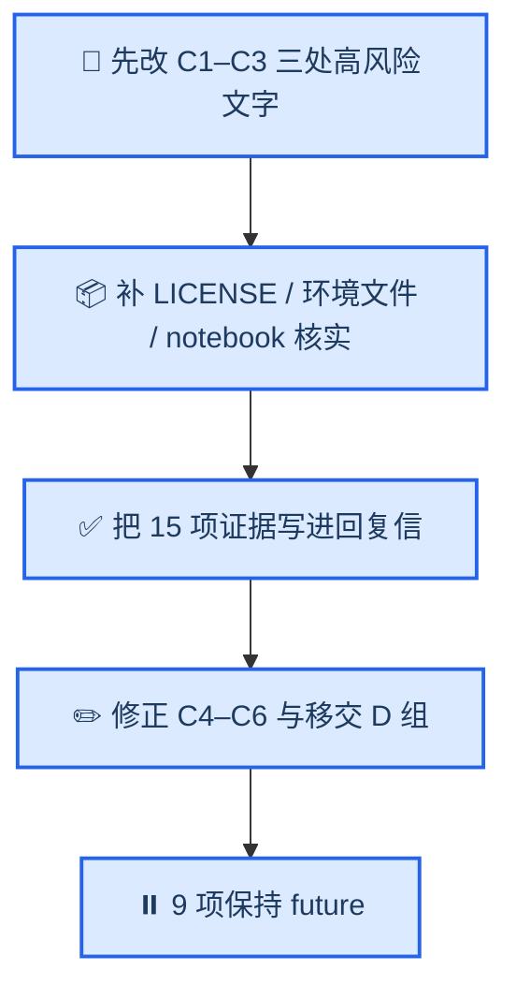

# MALER 审稿意见 → 实现侧对照表

_把 `MALER_Response_Letter_Draft.docx`（55 条）与 `MALER_Revision_Guidance_CN.docx` 中涉及实现的意见逐条映射到当前代码与仓库 · 实测于本地 `maler` 环境 · 更新于 2026-09-22（E1 已完成）_

---

## 📋 TL;DR

- 筛出 **37 项**涉及实现的意见，按处理方式分为五类（见[结论分布](#-结论分布)）。
- **代码侧已无待办**：唯一需要改代码的 E1（预测特征对齐提示）已于本轮实现并测试通过，复述该项的延期条目也已合并，不再重复计数。
- **仍需补齐 3 项仓库物料**：`LICENSE`、Linux 环境文件、参考 notebook —— 三者都是审稿人明确要求且未被任何文件拒绝的。
- **6 处文字与代码不符**必须修改，其中 Cox 预筛描述、上传上限、插补方式最容易被对照代码发现；逐条改法见 [`response-letter-changes.md`](response-letter-changes.md)。
- 模型注册表经核对完整（26 个模型均有 `class`/`defaults`/`grid`），R2#6、R3 Major 4、R3 Minor 5 无缺口。

---

## 🎯 判定口径与图例

| 状态 | 含义 | 后续动作 |
| --- | --- | --- |
| ✅ 已实现 | 代码/仓库已满足 | 把证据写进回复信 |
| 📦 需补物料 | 审稿人要求、且**未被**文件拒绝的仓库文件 | 补齐并入库 |
| 📄 需改文字 | 文字与代码不符，代码为准 | 修订正文/表格/回复信 |
| ⏸️ 文件声明不做 | 两份文件明确写"future version" | **以文件为准，本轮不做** |
| 🚫 非代码 | 数据准备、统计公式、术语、文献 | 归入稿件侧 |

> 📌 筛选规则：只把「审稿人明确要求」且「两份文件没有明确拒绝」的条目计入 📦；文件地位更高的条目一律落入 ⏸️。

---

## 📊 结论分布

| 结论 | 数量 | 说明 |
| --- | --- | --- |
| ✅ 已实现 | 15 | 含本轮完成的 E1；其余为 CV 折内拟合、优化指标、注册表、输入质控、导出内容、扩展指标等 |
| ⏸️ 文件声明不做 | 9 | 含校准曲线、高级插补、算法特定预处理、容器化、系统性基准等 |
| 📄 需改文字 | 6 | Cox 预筛、上传上限、插补方式、CV 立场、future 清单、旧模块表述 |
| 🚫 非代码 | 4 | 划分细节、Data Availability、回归公式、术语文献 |
| 📦 需补物料 | 3 | LICENSE、Linux 环境文件、参考 notebook |
| **合计** | **37** | 原 38 项中的 E1 与其延期表述 B9 已合并为一条 |

---

## ✅ 已实现（只需把证据写进回复信）

| # | 意见来源 | 事项 | 代码/产物证据 |
| --- | --- | --- | --- |
| A1 | 指导 §一；信 R2#4、R2#5、R3 Major 2 | 插补/缩放/选择/调参全部折内完成 | `safe_ml.py:262-281`（Pipeline）、`safe_ml.py:445-479,506-537`（嵌套内外层）、`validated_analysis.py:238-253,347` |
| A2 | 指导 §一；信 R2#6、R3 Major 4 | 各任务优化指标 | `model_registry.py:20,86,146`；`safe_ml.py:560-568`；UI 说明 `analysis.html:2374` |
| A3 | 信 R2#6、R3 Minor 5、R3 Major 8 | 精确类名、默认值、搜索字段 | 注册表完整：26 个模型均含 `class`、`requires_scaling`、`defaults`、`grid`；UI `analysis.html:2375` 指向 `analysis/methods.json` |
| A4 | 信 R3 Minor 6 | 输入质控（空/重复/非数值/无穷/全缺失/超 80% 缺失/零方差） | `safe_ml.py:73-118`；`validate_target` |
| A5 | 信 R3 Minor 9 | 预测按标识匹配并检测异常特征 | `safe_ml.py:590-609` |
| A6 | 指导 §一；信 R3 Minor 8 | 导出内容含预处理与元数据 | `safe_ml.py:612-649`：`manifest.json`（`feature_names`/`model_class`/`versions`）+ `model.joblib` + `signature.sha256`，模型为完整 Pipeline |
| A7 | 指导 §二 | MRMR 的包与函数 | `safe_ml.py:163-169`；实测 `mrmr-selection 0.2.8` 支持 `n_jobs`/`show_progress` |
| A8 | 指导 §三；信 R1#5、R2#8 | specificity / balanced accuracy / MCC / PR-AUC / 多分类 macro 指标 | `internal_cv_summary.csv`；结果页通用指标表 `validated_result.html:47-53` |
| A9 | 信 R2#9、R3 Major 5 | time-dependent AUC 与 integrated Brier score | `heldout_test_summary.csv`；`survival.json` |
| A10 | 信 R2#2、R3 Major 1 | 多分类/回归/生存验证与无选择基线 | `multiclass_classification.json`、`regression.json`、`survival.json`、`survival_expanded_validation.json`、`equal_budget_no_selection_baselines.json` |
| A11 | 信 R3 Minor 3 | 留出集不确定性 | `heldout_test_summary.csv` 的 `bootstrap_ci_low/high`；2000 次重采样 |
| A12 | 信 R2#14、R2#15、R3 Major 9 | 结果链接保护、保留期、自动清理、隐私提示 | `task_access.py`；`settings.py:96-99`；`cleanup_maler_cache.py`；`predict.html:240`；`validated_result.html:77` |
| A13 | 信 R1#3 | PCA / 特征提取现状 | UI 选项 `analysis.html:473`；说明 `analysis.html:476`；`methods.json`；`pca_sensitivity.json` |
| A14 | 指导 §二 | 随机种子固定并报告 | `safe_ml.py:56`；`validated_analysis.py:253`；结果文件记录 `random_state: 10` |
| A15 | **信 R3 Minor 9（本轮完成）** | 预测矩阵**列顺序不一致与多余列**会向用户报告 | `safe_ml.py` 的 `alignment_report`（只报告不改数据）；`predict_result.py` 7 处调用点收集，经 `predict_pickle` 载荷贯穿 POST 与 GET 两条渲染路径；`predict_result.html` 提示区块；新增 10 项测试（7 单元 + 3 页面级），套件 36 → 46 全绿；预测数值与改动前逐位一致 |

---

## 📦 需补仓库物料

| # | 事项 | 审稿人要求 | 现状证据 | 动作与验收 |
| --- | --- | --- | --- | --- |
| M1 | `LICENSE` | R2#12 明确列出 licence | 仓库无 `LICENSE` | 选定许可证后新增；验收：根目录存在且与 Data Availability 措辞一致 |
| M2 | Linux 环境文件与运行说明 | R2#12："environment files"、"example data/tutorial material" | 仅有 Windows 导出 `ml_python37.yml`；根 `README.md` 为 **0 字节** | 把 [`environment-setup.md`](environment-setup.md) 的清单落成 `requirements-linux-py37.txt`，并补 README 的安装/测试/启动步骤；验收：新人照此可复现 46 项测试 |
| M3 | 参考 notebook / 教程材料 | 信 R2#10、R3 Major 8 与标记 #44 引用 "public notebooks" | 本仓库 `.ipynb` 数量为 **0** | 先确认是否位于另一公开仓库；若不存在则发布或撤下承诺；验收：回复信引用的每个仓库与 notebook 均可访问 |

---

## 📄 文字与代码不符（必须改文字）

| # | 事项 | 文字当前说法 | 代码/配置实际 |
| --- | --- | --- | --- |
| C1 | 单因素 Cox 预筛 | 信 R3 Major 4 写 "lifelines `CoxPHFitter` … univariate Cox p-value" | `safe_survival.py:80` 用**向量化 Cox score statistic**，不依赖 lifelines、不按 p 值排序 |
| C2 | 上传上限 | 信 R1#6 与指导文档写 300 MB | `settings.py:93` 与 Nginx 模板均为 200 MB |
| C3 | 缺失值处理 | 信 R1#10、R3 Major 7 写 mean imputation | 默认 `SimpleImputer(strategy="median")` |
| C4 | 交叉验证立场 | 信 R2#5、R3 Major 2 称"非折内、非嵌套"并列为 future | 已折内重拟合并使用嵌套结构（A1） |
| C5 | 六类 future 承诺 | PCA、扩展分类指标、扩展生存指标、多任务验证、完整 pipeline 导出、留出集置信区间被列为 future | 均已实现（A6、A8、A9、A10、A11、A13） |
| C6 | 旧模块性质 | 笔记称"残留旧模块只是不可访问的兼容性代码" | 路由已禁用，但 6 个模块仍被 `urls.py:5-8` 顶层导入，且 `/maler/get_cp_combination` 仍指向 legacy 模块（`urls.py:69`） |

> ⚠️ C1–C3 最容易被审稿人对照代码发现；逐条改法见 [`response-letter-changes.md`](response-letter-changes.md)。

---

## ⏸️ 两份文件明确声明不做（本轮不实现）

| # | 事项 | 出处立场 | 代码现状 |
| --- | --- | --- | --- |
| B1 | 高级插补方法 | 指导 §四："added in future releases" | 仍为 median，与声明一致 |
| B2 | 算法特定预处理管道 | 指导 §四；信 R3 Major 7 | 未实现，仅 UI 给出缩放提示（`analysis.html:414`） |
| B3 | 容器化 / 本地部署包 | 指导 §四；信 R2#12、R2#13 | 无 Docker/发布包 |
| B4 | 系统性小/中/大规模基准 | 信 R2#11 | 仅单一容量脚本，且限 Windows |
| B5 | 与独立 Python/R 脚本的同划分基准 | 信 R2#10 | 未实现 |
| B6 | WDL / PMML / ONNX 工作流导出 | 信 R1#11 | 未实现 |
| B7 | 正式可用性用户研究 | 指导 §四；信 R1#8 | 非代码 |
| B8 | Top-50 / TopK 的用户可配置 | 信 R2#7："planned for future versions" | 引擎层 `max_candidates=50` 已参数化（`safe_ml.py:189`），UI 未暴露 |
| B9 | 校准曲线 | 信 R2#9 与 R3 Major 5 均列为 future extensions | 已有 `time_auc_mean`、`integrated_brier_score`；无 calibration |

---

## 🚫 非代码（归入稿件侧）

| # | 事项 | 为什么不是代码问题 |
| --- | --- | --- |
| D-1 | LUAD/LUSC 划分细节（数量、比例、种子、分层、患者级规则、Xena 编号） | 划分来自数据自带的 `set` 标记，代码只校验不随机划分（`validation/run_reviewer_validation.py:87-125`） |
| D-2 | Data Availability 中 KIRC/GBM/CGGA 的取舍 | 文本与结果对齐（CGGA 已用于扩展生存验证） |
| D-3 | 回归公式索引与 C-index 措辞 | 统计表述 |
| D-4 | 上传上限最终口径 | 若选择提高上限而非改文字，则需改 `settings.py` 与 Nginx 模板（配置改动，非逻辑代码） |

---

## 🗺️ 处理顺序

---

## 🚨 风险提示

| 风险 | 应对 |
| --- | --- |
| 文字继续滞后于代码（C4、C5 把已交付功能说成未来计划） | 以 A 组证据重写相关条目，改法见 [`response-letter-changes.md`](response-letter-changes.md) |
| 为迁就文字而回退代码（如改回 mean 插补） | 默认以代码为准，仅在有充分理由时改代码 |
| 回复信承诺的仓库物料不存在（M3 的 notebook、M1 的 licence） | 先核实可访问性，再决定发布或撤改承诺 |
| A15 的实现未被稿件提及 | 若稿件不提该提示，回复信就不要声称已实现 |

---

## 📎 附录：未纳入本轮范围的工程卫生项

<strong>📋 H1–H9、H11 明细</strong>

| # | 事项 | 证据 | 为何不在本轮范围 |
| --- | --- | --- | --- |
| H1 | 孤儿邮件模块带导入期副作用与硬编码邮箱 | `mlserver/views/send_email.py:26-33` | 未被引用，休眠状态 |
| H2 | `get_cp_combination` 仍挂 legacy 模块，阻塞死代码删除 | `urls.py:69` | 属重构；但会影响 C6 的表述 |
| H3 | 验证脚本无条件覆盖写 `validation/results/*.json` | `audit_survival_data_quality.py:126-127` 等 | 本地运行纪律 |
| H4 | 出图脚本输出到仓库之外 | `make_validation_figures.py:29` | 与图片交付节奏有关 |
| H5 | 容量脚本仅限 Windows | `benchmark_capacity.py:11,19,47` | 与 B4 声明一致 |
| H6 | 被 git 跟踪的 4 个备份模板 | `analysis.html.bak`、`analysis.html (2).bak`、`analysis.html.1114bak`、`home.html.bak` | 仓库卫生 |
| H7 | 被跟踪的字节码文件 | `mlserver/migrations/__pycache__/__init__.cpython-37.pyc` | 每次运行即被改写，提交前需还原 |
| H8 | 模块名拼写错误 | `classification_oc_result_view_webscoket.py` | 随 H2 一并处理更省事 |
| H9 | 死注释与旧路径 | `settings.py:181-186`；`predict_views.py:168-190`（注释块内，非缺陷） | 清理性改动 |
| H11 | 外部数据获取脚本缺失 | `run_external_gse37745.py` 等依赖未入库矩阵 | 无对应审稿要求 |

> 📌 新增观察：`predict_result.py` 等模块以 `from ML_WebServer.settings import STATIC_ROOT` 方式绑定常量，导致 `override_settings` 无法生效；本次测试通过替换模块属性绕开。若将来要统一测试风格，需先改这一绑定方式。

---

## 🔗 相关文档

- [`response-letter-changes.md`](response-letter-changes.md) — 回复信逐条待改清单（含 9 处待核实标记的答案）
- [`environment-setup.md`](environment-setup.md) — 本地最小环境与验收证据（M2 的数据来源）
- [`revision-status.md`](revision-status.md) — 返修工作状态、执行计划与已知不一致
- [`../validation/README.md`](../validation/README.md) — 验证脚本的设计口径
