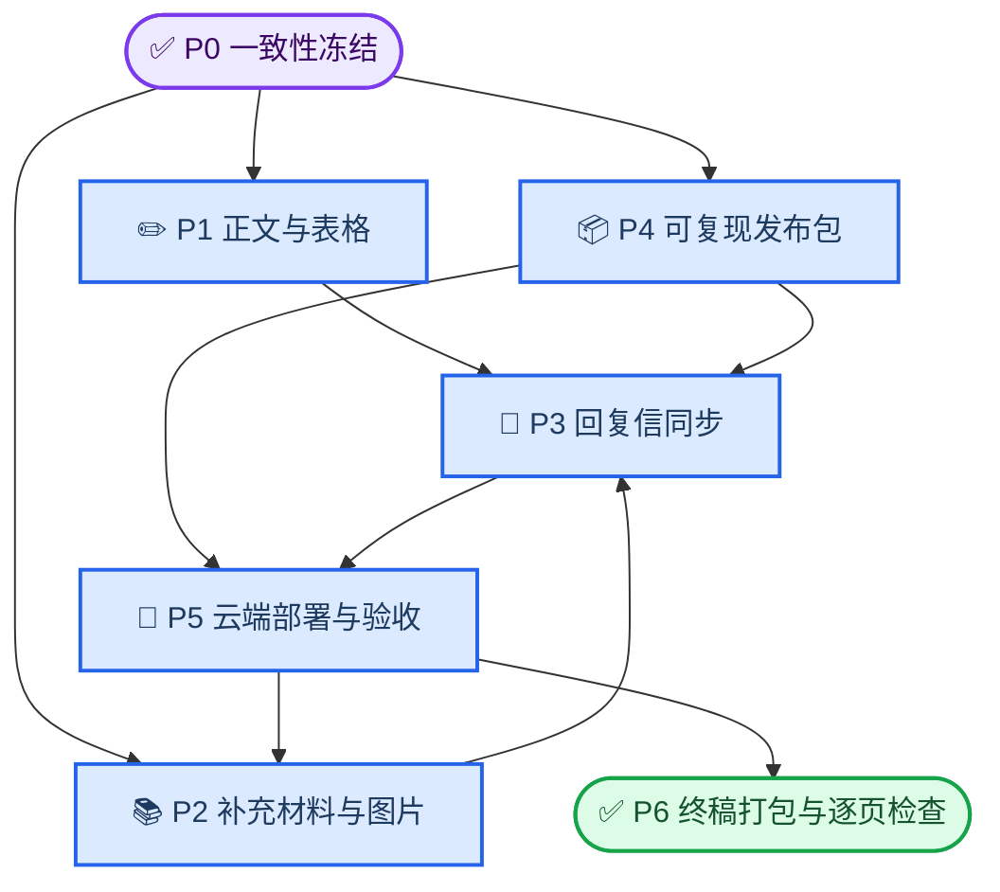
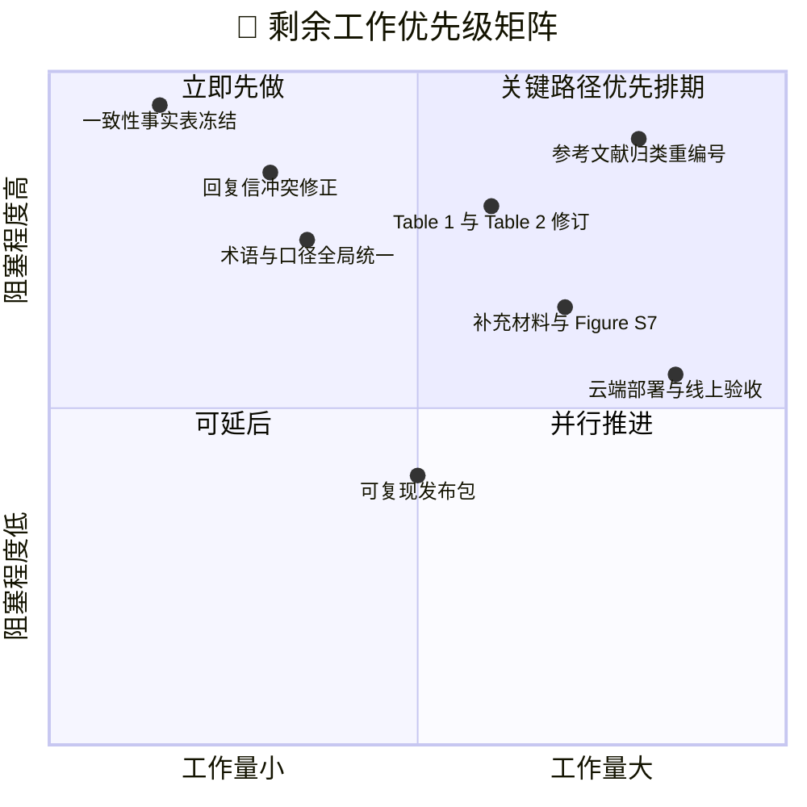

# MALER 返修 — 工作状态与执行计划

_汇总已完成与待完成工作 · 依据本地仓库 `921327e` 核对 · 最后更新 2026-09-22_

---

## 📋 TL;DR

- **代码与证据链已完成**：统一验证引擎、安全控制、36 项测试与 27 份验证结果文件均已随 `921327e` 提交。
- **缺口集中在文字层**：正文参考文献、Table 1/2、补充材料、Figure S7 与回复信尚未与当前实现对齐，且正文材料不在本工作区（位于 Windows 侧）。
- **最先要做的事**：冻结「单一事实表」，消除回复信与代码之间的 5 处实质冲突。
- **最大风险**：回复信草稿仍写着 mean imputation、300 MB 上传上限、CV 非折内，与仓库实现不符；若原样提交，审稿人对照代码即可发现。
- **部署**：阿里云部署按约定在全部材料定稿后一次性执行，前置条件与验收项见 [云端部署](#-云端部署最后一次性执行) 一节。

---

## 🚦 状态总览

| 领域         | 状态            | 趋势 | 说明                                                       |
| ------------ | --------------- | ---- | ---------------------------------------------------------- |
| 代码与安全   | 🟢 已完成       | →    | `921327e` 已含统一验证引擎与生产安全控制                   |
| 验证实验     | 🟢 已完成       | →    | 27 份结果文件齐备，含两个独立外部队列                      |
| 仓库卫生     | 🟢 已完成       | ↑    | 全库无 `*.partial`，无遗留 docx/xlsx/pdf（`temp/` 除外）   |
| 正文与表格   | 🔴 未开始       | →    | Table 1/2 与参考文献需重做，材料在 Windows 侧              |
| 补充材料与图 | 🔴 未开始       | →    | 缺 Figure S7；补充报告版本落后于最终结果                   |
| 回复信       | 🟡 部分完成     | ↓    | 55 条已有草稿，但 5 处与实现冲突，含大量待核实占位         |
| 可复现发布包 | 🟡 部分完成     | →    | 缺 `README.md`、`LICENSE`、`requirements`、数据来源清单    |
| 云端部署     | 📋 已排期（最后） | →    | 云端仍运行 `ad4df79`，与本地 `921327e` 相差一个完整版本    |

**状态键：** 🟢 已完成 · 🟡 部分完成 · 🔴 未开始 · 📋 已排期
**趋势键：** ↑ 改善 · → 稳定 · ↓ 出现退化风险

> 📌 **核对范围**：标 ✅ 的事实由本次直接核对（文件读取或命令输出）；标 ⚠️ 的事实来自既有笔记或依赖 Windows 侧材料，本次未复核。

---

## ⚠️ 需要决定的事项

### 决定 1：正文材料是否纳入本工作区

**背景：** 正文 DOCX、Table 1–3、补充报告与图片目录都位于 Windows（`E:\CodeProject\Server\article-review\revision\...`）。本仓库只有代码与验证产物，因此 P1–P3 目前只能产出「待替换文本」，无法直接定稿。

| 选项                            | 影响                                             | 建议         |
| ------------------------------- | ------------------------------------------------ | ------------ |
| 把正文材料同步进本仓库子目录    | 我可以直接改稿、自动检查引用与表号，且改动可回溯 | 推荐         |
| 保持现状，只在对话中给出替换文本 | 每次都要人工粘贴，易漏改、易失同步               | 不推荐       |

### 决定 2：交叉验证与设计口径

**背景：** 论文分析设计为 5 折 × 10 重复外层 + 3 折内层（`validation/README.md` ✅），而网页 UI 默认是 5 折 × 2 重复 × 3 折内层（`ML_WebServer/settings.py` ✅）。两者都真实存在，但回复信目前按「非折内」叙述，已过期。

| 选项                                    | 影响                                     | 建议     |
| --------------------------------------- | ---------------------------------------- | -------- |
| 正文写分析设计（5×10×3），补充材料写 UI 默认（5×2×3），两处都明示 | 与代码、`README` 完全一致，无矛盾        | 推荐     |
| 全文统一写 5×2×3                        | 与已产出的验证结果不符（结果是 50 折）   | 不推荐   |
| 全文统一写 5×10                         | 与公开网页实际默认不符                   | 不推荐   |

### 决定 3：上传上限口径

**背景：** 实现与配置三处一致为 **200 MB**（`settings.py`、`nginx_maler.conf.example`、`legacy_server.env.example` ✅），但回复信与指导文档都写 300 MB。

| 选项                          | 影响                                   | 建议   |
| ----------------------------- | -------------------------------------- | ------ |
| 正文与回复信改为 200 MB       | 与现状一致，改动最小                   | 推荐   |
| 提高服务器上限到 300 MB       | 需同时改 settings、Nginx 与云端配置    | 可选   |

### 决定 4：代码公开方式

**背景：** 回复信目前声称公开 GitHub 仓库提供示例数据与参考 notebook，但根目录 `README.md` 为 0 字节，且无 `LICENSE`。

| 选项                                   | 影响                                     | 建议   |
| -------------------------------------- | ---------------------------------------- | ------ |
| GitHub 公开 + Zenodo 固定 DOI          | 最有利于审稿，且可写入 Data Availability | 推荐   |
| 压缩包作为 Supplementary Software 上传 | 省事，但无法被引用于代码可用性声明       | 可选   |
| 维持「repository release pending」     | 诚实但削弱可复现性得分                   | 兜底   |

> ⚠️ 无论选哪种，**只有地址实际可访问后**才能把 URL 或 DOI 写进正文。

---

## 📊 关键指标

| 指标                        | 数值                                              | 来源                          |
| --------------------------- | ------------------------------------------------- | ----------------------------- |
| 自动化测试数量              | 36 项                                             | `mlserver/tests.py` ✅        |
| 验证结果文件数              | 27                                                | `validation/results/` ✅      |
| 二分类内部 CV（50 折）      | ROC-AUC 0.982 ± 0.013；balanced accuracy 0.941    | `internal_cv_summary.csv` ✅  |
| 二分类 held-out 测试        | ROC-AUC 0.987（95% CI 0.973–0.997）               | `heldout_test_summary.csv` ✅ |
| 多分类内部 CV（50 折）      | Macro OvR AUC 0.997 ± 0.003；accuracy 0.966       | `internal_cv_summary.csv` ✅  |
| 回归内部 CV（50 折）        | R² 0.904 ± 0.045；MAE 0.027                       | `internal_cv_summary.csv` ✅  |
| 生存分析内部 CV（50 折）    | C-index 0.526 ± 0.071                             | `internal_cv_summary.csv` ✅  |
| 外部 GSE37745（阈值未校准） | ROC-AUC 0.983；balanced accuracy 0.783            | `external_gse37745_summary.csv` ✅ |
| 外部 GSE50081（阈值已校准） | balanced accuracy 0.877（0.819–0.933）；ROC-AUC 0.891（0.819–0.954） | `validation/README.md` ⚠️ |
| 生存跨队列迁移 TCGA→CGGA    | 内部 0.603 ± 0.056 → CGGA 0.523（0.470–0.579）    | `validation/README.md` ⚠️     |
| GBSG2 阳性对照 benchmark    | holdout C-index 0.700（0.641–0.756）              | `validation/README.md` ⚠️     |
| 容量测试峰值                | 1000 × 5000 矩阵耗时 7.72 s，峰值 344.6 MB        | `validation/README.md` ⚠️     |
| 生产配置安全审计            | 10 / 10 项通过                                    | `production_security_audit.json` ✅ |
| 正文参考文献                | 71 条中约 25 条被引用，46 条待处理                | `temp/progress-so-far.md` ⚠️  |
| 云端运行版本                | `ad4df79`（落后本地 `921327e`）                   | `temp/progress-so-far.md` ⚠️  |

> 📌 外部队列分别为 GSE37745[^1]（阈值校准队列）与 GSE50081[^2]（未参与阈值选择的最终测试队列），阳性对照为 GBSG2[^3]，开发集来自 TCGA[^4]，跨队列压力测试使用 CGGA[^5]。

---

## ✅ 已完成的工作

### 核心代码与安全控制

| 模块                    | 内容                                                                       |
| ----------------------- | -------------------------------------------------------------------------- |
| `validated_analysis.py` | 统一验证引擎；外层 5×2、内层 3 折由环境变量驱动，折内重拟合                 |
| `safe_ml.py`            | 折内流水线；插补为 `SimpleImputer(strategy="median")`，默认中位数而非均值    |
| `safe_survival.py`      | 生存分析安全流程与风险评分方向校验                                          |
| `security.py`           | 模型签名与安全加载，拒绝未签名或被篡改的模型包                              |
| `task_access.py`        | 任务级访问令牌，受控结果下载                                                |
| `model_registry.py`     | 模型注册表（类名、版本、缩放需求、splitter、默认参数）                      |
| `middleware.py`         | 安全响应头与请求约束                                                        |
| `management/commands/`  | `audit_security_configuration`、`cleanup_maler_cache`、`export_model_registry` |
| `ML_WebServer/settings.py` | 生产默认值：`DEBUG` 非 runserver 时为 False、`ALLOWED_HOSTS` 取自环境变量、安全 Cookie、HSTS/SSL 开关、上传上限 200 MB、模型签名密钥、旧探索接口关闭 |
| 旧计算端点              | 历史 WebSocket 分析路由已禁用，公开分析统一走验证引擎                       |

### 验证实验与结果证据

`validation/results/` 下 27 份产物覆盖：二分类、多分类、回归、生存分析四类任务；`internal_cv_summary.csv` 与 `heldout_test_summary.csv` 汇总；`external_gse37745.json` 与 `external_gse50081.json` 外部队列；`survival_expanded_validation.json` 扩展生存证据；`pca_sensitivity.json` 与 `equal_budget_no_selection_baselines.json` 敏感性对照；`capacity_benchmark.json` 容量测量；`external_data_quality_audit.json`、`survival_data_quality_audit.json`、`legacy_survival_external_audit.json` 数据质量审计；`model_registry.json` 模型清单；`production_security_audit.json` 配置级安全审计。

脚本入口：`run_reviewer_validation.py`、`run_external_gse37745.py`、`run_external_gse50081.py`、`run_survival_expanded_validation.py`、`run_pca_sensitivity.py`、`run_equal_budget_baselines.py`、`benchmark_capacity.py`、`audit_*.py`、`make_validation_figures.py`。

### 文档与部署基线

- `validation/README.md`：评估设计、外部队列完整性校验、生存证据、容量证据、安全证据与主要局限，是方法学叙述的事实来源。
- `deployment/README.md`：Python 3.7 / Django 2.1 的部署顺序与检查项。
- `deployment/nginx_maler.conf.example`：含缓存目录阻断规则 `location ^~ /mlserver_static/cache/ { return 404; }` 与 `client_max_body_size 200m`。
- `deployment/legacy_server.env.example`：环境变量模板。
- `ml_python37.yml`：现有服务器环境导出。

### 仓库卫生

- 全库无 `*.partial` 残留文件。
- `temp/` 之外无遗留的 docx/xlsx/pdf。
- `temp/` 已被 `.gitignore` 忽略，规划类草稿不会进入提交历史。

---

## 🔄 待完成的工作

### P0 一致性冻结（本地可完成）

| 工作项                         | 产出物                     | 依赖     | 验收标准                               |
| ------------------------------ | -------------------------- | -------- | -------------------------------------- |
| 建立「单一事实表」             | 本文件指标表 + 术语对照表   | 无       | 每项均能指向具体文件与行号             |
| 锁定插补、上限、CV、队列角色   | 事实表条目                 | 无       | 与代码、`model_registry.json` 逐格一致 |
| 明确「论文设计」与「UI 默认」两套 CV 数字 | 术语表条目        | 决定 2   | 正文与补充材料分别标注来源             |

### P1 正文与表格（Windows 侧）

| 工作项              | 产出物                             | 依赖     | 验收标准                                       |
| ------------------- | ---------------------------------- | -------- | ---------------------------------------------- |
| 参考文献逐篇归类    | 重编号后的文献表 + 正文引用         | P0       | 每篇至少被引用一次，每个正文编号都存在         |
| 删除弱相关文献      | 精简后的文献表                     | P0       | BioPlat、GWAS 等与论证无关者已移除             |
| 修正 Table 1        | 新版 Table 1                       | P0       | 中位数插补、MRMR 包名与函数、候选范围、基线    |
| Table 2 + 参数补充表 | 正文表 + 补充表                    | P0       | 与 `model_registry.json` 一致，含种子与搜索上限 |
| 全文术语与 claim 收敛 | 修订版正文                       | P0       | 无 mean imputation、无「independent external」 |

### P2 补充材料与图片

| 工作项                  | 产出物                        | 依赖     | 验收标准                             |
| ----------------------- | ----------------------------- | -------- | ------------------------------------ |
| 更新补充报告            | 新版 Supplementary            | P1       | 测试数改为 36，迁移表述更新          |
| 新增 Figure S7 及图注   | S7 图与说明                   | 部署     | 正文提到的 S1–S7 全部存在            |
| 修正图片输出路径        | 可复现的 `make_validation_figures.py` | 无 | 产物落在受版本控制的目录             |
| 更新界面截图            | 新版主页与流程截图            | 部署     | 截图日期与实际版本一致               |
| 逐页渲染检查            | 渲染记录                      | P2 全部  | 跨页表头重复、图片清晰度、目录页码   |

### P3 回复信同步

| 工作项                     | 产出物            | 依赖     | 验收标准                               |
| -------------------------- | ----------------- | -------- | -------------------------------------- |
| 修正 5 处与实现的冲突      | 修订后的回复信    | P0       | mean/300 MB/非折内等表述全部更正       |
| 填实待核实占位             | 无占位符的回复信  | P0、P4   | 无 `AUTHOR VERIFICATION REQUIRED` 残留 |
| 引用补充表编号与 Figure S7 | 定稿回复信        | P1、P2   | 编号与补充材料一致                     |
| 定位到实际章节或页码       | 定稿回复信        | P1、P2   | 「Changes in the manuscript」指向真实位置 |

### P4 可复现发布包

| 工作项              | 产出物                        | 依赖   | 验收标准                             |
| ------------------- | ----------------------------- | ------ | ------------------------------------ |
| 补齐基础文件        | `README.md`、`LICENSE`、`requirements` | 无 | 根目录 `README.md` 非空且可照做      |
| 环境文件            | Windows 最小环境 + Linux 服务器环境 | 无 | 与 36 项测试通过的环境一致           |
| 数据来源与校验清单  | 来源、筛选规则、SHA-256 清单  | 无     | 与 `validation/README.md` 已记录哈希一致 |
| 示例输入与运行说明  | 示例数据 + 步骤               | 无     | 按说明可复现一次验证运行             |
| 排除敏感内容        | 打包脚本或清单                | 无     | 无数据库、缓存、上传件、密钥、日志   |

### P5 阿里云部署与线上验收（最后一次性）

| 工作项                | 产出物                | 依赖     | 验收标准                       |
| --------------------- | --------------------- | -------- | ------------------------------ |
| 部署 `921327e`        | 云端代码更新          | 全部定稿 | 版本号与本地一致               |
| 生产环境变量          | 云端配置              | 部署     | 密钥独立、`DEBUG=False`        |
| Nginx 缓存阻断        | 配置更新              | 部署     | `/mlserver_static/cache/` 返回 404 |
| 定时清理              | 每小时任务            | 部署     | 任务真实执行且有日志           |
| 功能与安全验收        | 验收记录              | 部署     | 三类检查全部通过               |

### P6 终稿打包与逐页检查

| 工作项              | 产出物                | 依赖     | 验收标准                   |
| ------------------- | --------------------- | -------- | -------------------------- |
| 建立干净投稿目录    | 只含投稿材料的目录    | P1–P5    | 无 QA 图片、脚本、中间文件 |
| 双版本一致性检查    | 检查记录              | P6 首项  | 修订版与干净版逐段一致     |
| 逐页渲染检查        | 检查记录              | P6 首项  | 无批注、无错位、编号一致   |

---

## 🧩 已知不一致（提交前必须修正）

回复信草稿与指导文档已明显滞后于当前实现，以下 5 处若原样提交会被对照代码发现：

| # | 草稿说法                              | 实际实现                                  | 需同步的位置                     |
| - | ------------------------------------- | ----------------------------------------- | -------------------------------- |
| 1 | simple **mean** imputation            | `SimpleImputer(strategy="median")`        | 正文 Methods/Results、Table 1、回复信 |
| 2 | 上传上限 **300 MB**                   | 200 MB（三处配置一致）                    | 正文、回复信                     |
| 3 | CV「非折内、非 nested」               | 已验证引擎折内重拟合，主分析 5×10×3       | 正文 Methods、回复信             |
| 4 | PCA 敏感性、无选择基线、扩展生存指标列入 future | 三项均已完成并产出结果文件        | 回复信（可正面回答而非全部推后） |
| 5 | 从 Data Availability 删除 CGGA        | CGGA 已用于扩展生存验证                   | Data Availability 与结果需重新对齐 |

工程侧另有两项待修：

| 项                     | 问题                                                     |
| ---------------------- | -------------------------------------------------------- |
| 图片输出路径           | `make_validation_figures.py` 输出到仓库之外，打包易漏     |
| 部署文档路径与栈       | `deployment/README.md` 的路径示例与真实服务器路径不一致；`deployment/` 仍保留 uWSGI 模板而线上使用 Gunicorn |

---

## 🗺️ 执行顺序

_P0 是所有后续工作的前置；P1 与 P2 可并行；P5 云端部署按约定在全部材料定稿后一次性执行：_

_剩余工作在「工作量」与「对投稿的阻塞程度」两个维度上的位置，用于决定投入顺序：_

**顺序要点：**

1. P0 立刻做，成本最低但解锁全部后续工作。
2. 参考文献与 Table 1/2 处于关键路径高阻塞区，需排期而不是顺手改。
3. 可复现发布包可与正文工作并行，但必须先于回复信中「代码可获得」类表述定稿。
4. 云端部署与截图放最后一次性完成，避免图片与页码反复变动。

---

## 🚨 风险与阻塞

| 风险                                     | 可能性   | 影响     | 应对                                            |
| ---------------------------------------- | -------- | -------- | ----------------------------------------------- |
| 回复信与代码表述不一致被审稿人发现       | 🔴 高    | 🔴 高    | P0 先冻结事实表，再逐条核对回复信               |
| 正文材料不在本工作区导致改稿失控         | 🔴 高    | 🟡 中    | 见决定 1，建议纳入版本控制                      |
| 图片与页码在部署后变动，需重复校对       | 🟡 中    | 🟡 中    | 把部署与截图放到最后，先定稿文字                |
| 云端长期落后于本地，线上行为与论文不符   | 🟡 中    | 🔴 高    | 部署前不得声称线上已更新；一次性部署后立即验收  |
| 声称未完成的验证（用户研究、渗透测试）   | 🟡 中    | 🔴 高    | 保持局限性表述，不写入「已完成」                |

| 阻塞项                           | 影响             | 需要谁解锁        |
| -------------------------------- | ---------------- | ----------------- |
| 正文 DOCX 与表格不在本工作区     | P1–P3 无法定稿   | 项目负责人        |
| 云端访问与授权                   | P5 无法启动      | 项目负责人        |
| 服务器密码曾在对话中传输         | 凭据泄露风险     | 项目负责人换密并改用 SSH 密钥 |

<strong>📋 已解决的历史问题</strong>

| 问题                            | 解决方式                                       |
| ------------------------------- | ---------------------------------------------- |
| 旧 WebSocket 分析端点仍可访问   | 已禁用，公开分析统一走验证引擎                 |
| 缺少模型签名与安全加载          | 已加入签名密钥与签名包校验                     |
| 缓存目录随静态目录公开          | 已在 Nginx 模板中加入阻断规则                  |
| 中断运行留下的 `.partial` 文件  | 已清理，最终 JSON 均为完整结果                 |

---

## 📍 云端部署（最后一次性执行）

> ⚠️ **约定：** 部署在 P1–P4 全部定稿后一次性执行。在此之前，线上仍为 `ad4df79`，任何材料都不得写成「在线网站已更新」。

部署前需具备：

| 前置项             | 说明                                                        |
| ------------------ | ----------------------------------------------------------- |
| 云端备份           | 备份代码、服务器专用配置、数据库、日志与历史结果            |
| 生产环境变量       | `DEBUG=False`、精确 `ALLOWED_HOSTS`、Django 密钥与模型签名密钥（两者必须不同） |
| Nginx 缓存阻断     | `location ^~ /mlserver_static/cache/ { return 404; }`，先检查后 reload |
| 定时清理           | 每小时执行 `cleanup_maler_cache --apply`                    |
| 服务重载           | 平滑重载 Gunicorn；失败立即回退到原提交与原配置             |
| 保留项             | `db.sqlite3`、`gunicorn.py`、日志、历史缓存、密钥与用户文件 |

部署后验收三类检查：

| 类别     | 检查项                                                                 |
| -------- | ---------------------------------------------------------------------- |
| 基础     | Django 系统检查、`/maler/home`、`/maler/analysis`、`methods.json` 均返回 200；静态资源与日志正常 |
| 分析流程 | 二分类、多分类、回归、生存、一键与自定义分析各跑一次小型数据，确认指标、图表、下载、删除可用 |
| 安全     | 无令牌不得下载、错误令牌被拒、不可越权读他人任务、旧 WebSocket 返回禁用、`/mlserver_static/cache/` 返回 404、篡改模型不能加载、路径穿越被拒 |

---

## 🚫 本轮明确不做

- 招募真实用户的正式可用性研究
- 前瞻性临床验证与实验室生物学验证
- 医疗器械认证与独立第三方渗透测试
- Python / Django 大版本升级（当前 3.7 / 2.1 为服务器兼容决策，需隔离并列入未来迁移）
- Celery / Redis 独立队列、从 Gunicorn 迁移到 uWSGI
- 立即删除线上约 2.1 GB 历史缓存
- 大规模并发压力测试与重新运行已完整成功的实验

---

## 🤝 协作约定

- 每次改动后立即 commit 并 push，便于同步进度。
- 提交信息沿用现有风格（`feat:` / `docs:` / `fix:` 前缀）。
- 云端部署集中在最后一次执行，避免中途产生前后矛盾的截图与页码。
- 任何「已完成」的表述都必须有对应文件或日志为证。

---

## 🔗 参考

- [仓库](https://github.com/zhaizhaoyu98/MALER_server) — 代码与验证产物的唯一来源
- [`validation/README.md`](../validation/README.md) — 评估设计与证据口径
- [`deployment/README.md`](../deployment/README.md) — 部署顺序与检查项
- [`temp/progress-so-far.md`](../temp/progress-so-far.md) — 前期规划笔记（未纳入版本控制）
- [NCBI GEO: GSE37745](https://www.ncbi.nlm.nih.gov/geo/query/acc.cgi?acc=GSE37745) — 阈值校准队列
- [NCBI GEO: GSE50081](https://www.ncbi.nlm.nih.gov/geo/query/acc.cgi?acc=GSE50081) — 未触碰的最终测试队列
- [UCSC Xena](https://xenabrowser.net/) — 开发集来源
- [CGGA](http://www.cgga.org.cn/) — 跨队列压力测试队列

---

_下次更新：P0 一致性事实表完成时。_

[^1]: NCBI GEO. "GSE37745" https://www.ncbi.nlm.nih.gov/geo/query/acc.cgi?acc=GSE37745
[^2]: NCBI GEO. "GSE50081" https://www.ncbi.nlm.nih.gov/geo/query/acc.cgi?acc=GSE50081
[^3]: R package TH.data. "GBSG2" https://rdrr.io/cran/TH.data/man/GBSG2.html
[^4]: UCSC Xena. "TCGA Pan-Cancer (PANCAN)" https://xenabrowser.net/datapages/
[^5]: CGGA. "Chinese Glioma Genome Atlas" http://www.cgga.org.cn/
